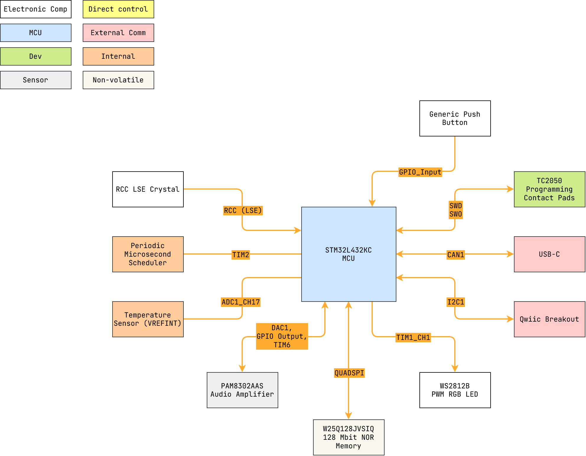

# hoppy_clock


STM32L432KC alarm clock lamp with optional backup source.

---

<details markdown="1">
  <summary>Table of Contents</summary>

<!-- TOC -->
* [Hoppy Clock Firmware](#hoppy-clock-firmware)
  * [1 Overview](#1-overview)
    * [1.1 Bill of Materials (BOM)](#11-bill-of-materials-bom)
    * [1.2 Block Diagram](#12-block-diagram)
    * [1.3 Pin Configurations](#13-pin-configurations)
    * [1.4 Clock Configurations](#14-clock-configurations)
  * [Third-Party Licenses](#third-party-licenses)
<!-- TOC -->

</details>

---

## 1 Overview

### 1.1 Bill of Materials (BOM)

| Manufacturer Part Number | Manufacturer        | Description             | Quantity | Notes |
|--------------------------|---------------------|-------------------------|---------:|-------|
| STM32L432KC              | STMicroelectronics  | 32-bit MCU              |        1 |       |
| WS2812B                  | (Various)           | PWM Addressable RGB LED |        1 |       |
| PAM8302AAS               | Diodes Incorporated | Audio Amplifier         |        1 |       |
| W25Q128JVSIQ             | Winbond Electronics | 128 Mbit NOR Memory     |        1 |       |

### 1.2 Block Diagram



> Drawio file here: [hoppy_clock.drawio](docs/hoppy_clock.drawio).

### 1.3 Pin Configurations

<details markdown="1">
  <summary>CubeMX Pinout</summary>


</details>

<details markdown="1">
  <summary>Pin & Peripherals Table</summary>

| STM32L432KC | Peripheral        | Config               | Connection                            | Notes                                                        |
|-------------|-------------------|----------------------|---------------------------------------|--------------------------------------------------------------|
| PA14        | `SYS_JTCK-SWCLK`  |                      | TC2050 SWD Pin 4: `SWCLK`             |                                                              |
| PA13        | `SYS_JTMS-SWDIO`  |                      | TC2050 SWD Pin 2: `SWDIO`             |                                                              |
| PB3         | `SYS_JTDO-SWO`    |                      | TC2050 SWD Pin 2: `SWO`               |                                                              |
|             | `TIM6`            | TRGO update event    |                                       | `DAC1_OUT1` TRGO.                                            |
|             | `ADC1` `VREFINT`  | Scan conversion mode | VDDA Sense                            | Configured in ADC1 rank 1.                                   |
|             | `ADC1_IN17`       | Scan conversion mode | Temperature Sensor Channel            | Configured in ADC1 rank 2.                                   |
| PA10        | `Reserved`        | 115200 bps           | GPIO Breakout: (ie Qwiic: `I2C1_SDA`) | Reserved GPIO breakout (PA10).                               |
| PA9         | `Reserved`        | 115200 bps           | GPIO Breakout: (ie Qwiic: `I2C1_SCL`) | Reserved GPIO breakout (PA9).                                |
| PA11        | `USB_DM`          | Device (FS)          | USB-C D-                              |                                                              |
| PA12        | `USB_DP`          | Device (FS)          | USB-C D+                              |                                                              |
| PA8         | `TIM1_CH1`        | PWM Generation CH1   | WS2812B-2020 Pin: `DIN`               | DIN pin number depends on IC variant.                        |
| PA4         | `DAC1_OUT1`       |                      | PAM8302AAS Input Circuit              |                                                              |
| PA1         | `GPIO_Output`     | Hardware pull-down   | PAM8302AAS Pin 1: `SD`                |                                                              |
| PA3         | `QUADSPI_CLK`     |                      | W25Q128JVSIQ Pin 6: `CLK`             |                                                              |
| PA2         | `QUADSPI_BK1_NCS` | Hardware pull-up     | W25Q128JVSIQ Pin 1: `CS`              |                                                              |
| PB1         | `QUADSPI_BK1_IO0` |                      | W25Q128JVSIQ Pin 5: `IO0`             |                                                              |
| PB0         | `QUADSPI_BK1_IO1` |                      | W25Q128JVSIQ Pin 2: `IO1`             |                                                              |
| PA7         | `QUADSPI_BK1_IO2` | Hardware pull-up     | W25Q128JVSIQ Pin 3: `IO2`             | Hardware pull-up for potential bringup from SPI single-line. |
| PA6         | `QUADSPI_BK1_IO3` | Hardware pull-up     | W25Q128JVSIQ Pin 7: `IO3`             | Hardware pull-up for potential bringup from SPI single-line. |

</details>

### 1.4 Clock Configurations

```
16 MHz High Speed Internal (HSI)
 -> Phase-Locked Loop Main (PLLM)
 -> 80 MHz SYSCLK
 -> 80 MHz HCLK
     -> 80 MHz APB1 (Maxed) -> 80 MHz APB1 Timer
     -> 80 MHz APB2 (Maxed) -> 80 MHz APB2 Timer
 -> 48 MHz PLLSAI1Q -> 48 MHz USB

32.768 kHz Low Speed External (LSE)
     -> 32.768 kHz RTC
```

---

## Third-Party Licenses

This project uses the following open-source software components:

- **STM32Cube HAL**, STMicroelectronics.
    - Licensed under the `3-Clause BSD License`.
        - See
          [`LICENSE.txt`](firmware/Drivers/STM32L4xx_HAL_Driver/LICENSE.txt).

> STMicroelectronics are trademarks of their respective owners. Use of these
> names does **not** imply any endorsement by the trademark holders.
