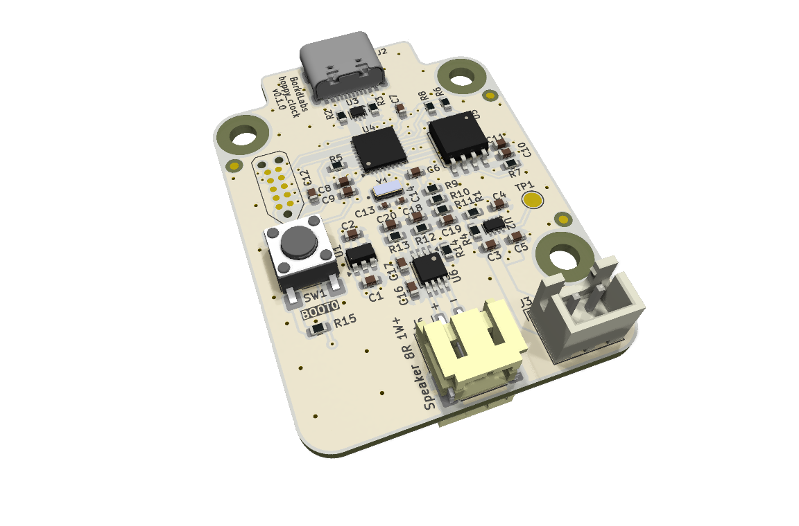
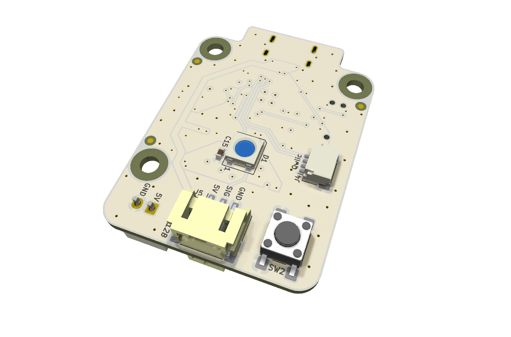

# hoppy_clock


STM32-based alarm clock and RGB lamp: custom alarms wake you with light and your
own songs, configured over USB.

---

<details markdown="1">
  <summary>Table of Contents</summary>

<!-- TOC -->
* [hoppy_clock](#hoppy_clock)
  * [1 Overview](#1-overview)
    * [1.1 Bill of Materials (BOM)](#11-bill-of-materials-bom)
    * [1.2 Block Diagram](#12-block-diagram)
    * [1.3 Pin Configurations](#13-pin-configurations)
    * [1.4 Clock Configurations](#14-clock-configurations)
  * [2 Board Specifications](#2-board-specifications)
    * [2.1 Connectors](#21-connectors)
    * [2.2 Switches & Jumpers](#22-switches--jumpers)
    * [2.3 LEDs](#23-leds)
    * [2.4 Test Pads](#24-test-pads)
    * [2.5 Power Supply](#25-power-supply)
    * [2.6 Speaker](#26-speaker)
  * [3 Firmware](#3-firmware)
    * [3.1 User Button Controls](#31-user-button-controls)
    * [3.2 USB Configuration](#32-usb-configuration)
  * [Third-Party Licenses](#third-party-licenses)
<!-- TOC -->

</details>

---

## 1 Overview

|                       Top                        |                         Bottom                         |
|:------------------------------------------------:|:------------------------------------------------------:|
|  |  |

**Features**:

- ⏰ **Alarms**: up to 64, each either weekly (any set of weekdays) or monthly
  (a day of the month) at a chosen time. Every alarm has its own light look,
  sound, volume fade-in, and auto-quiet timeout.
- 💡 **Lamp**: the single button toggles a warm lamp look on/off, the "off"
  state can settle to a dim ambient rather than fully dark.
- ✨ **Lights**: parametric looks (`solid` fade, `rainbow`, `sweep`, `breathe`)
  rendered across the onboard LED and any chained via the `WS2812B breakout`
  connector.
- 🔊 **Sounds**: two slots of ~4 minutes each (16-bit PCM @ 16 kHz), streamed
  from flash. Alarms play them with an optional fade-in.
- 🔋 **Low power**: the MCU sleeps between events and drops into STOP2 when
  fully idle, waking on the next alarm or a button press (useful on backup
  supply).
- 🔴 **Clock-unset cue**: if the time has never been set (for example after a
  full power loss), the onboard LED (index 0) blinks dim red until you set it.

### 1.1 Bill of Materials (BOM)

| Manufacturer Part Number | Manufacturer        | Description             | Quantity | Notes |
|--------------------------|---------------------|-------------------------|---------:|-------|
| STM32L432KC              | STMicroelectronics  | 32-bit MCU              |        1 |       |
| WS2812B                  | (Various)           | PWM Addressable RGB LED |        1 |       |
| PAM8302AAS               | Diodes Incorporated | Audio Amplifier         |        1 |       |
| W25Q128JVSIQ             | Winbond Electronics | 128 Mbit NOR Memory     |        1 |       |
| Generic Push Button      |                     |                         |        1 |       |

### 1.2 Block Diagram


> Drawio file here: [hoppy_clock.drawio](docs/hoppy_clock.drawio).

### 1.3 Pin Configurations

<details markdown="1">
  <summary>CubeMX Pinout</summary>


</details>

<details markdown="1">
  <summary>Pin & Peripherals Table</summary>

| STM32L432KC | Peripheral        | Config               | Connection                            | Notes                                                        |
|-------------|-------------------|----------------------|---------------------------------------|--------------------------------------------------------------|
| PA14        | `SYS_JTCK-SWCLK`  |                      | TC2050 SWD Pin 4: `SWCLK`             |                                                              |
| PA13        | `SYS_JTMS-SWDIO`  |                      | TC2050 SWD Pin 2: `SWDIO`             |                                                              |
| PB3         | `SYS_JTDO-SWO`    |                      | TC2050 SWD Pin 2: `SWO`               |                                                              |
|             | `TIM2_CH1`        | PWM no output        | Scheduling                            | Scheduler timer.                                             |
|             | `TIM6`            | TRGO update event    |                                       | `DAC1_OUT1` TRGO.                                            |
|             | `ADC1` `VREFINT`  | Scan conversion mode | VDDA Sense                            | Configured in ADC1 rank 1.                                   |
|             | `ADC1_IN17`       | Scan conversion mode | Temperature Sensor Channel            | Configured in ADC1 rank 2.                                   |
| PA10        | `Reserved`        | 115200 bps           | GPIO Breakout: (ie Qwiic: `I2C1_SDA`) | Reserved GPIO breakout (PA10).                               |
| PA9         | `Reserved`        | 115200 bps           | GPIO Breakout: (ie Qwiic: `I2C1_SCL`) | Reserved GPIO breakout (PA9).                                |
| PA11        | `USB_DM`          | Device (FS)          | USB-C D-                              |                                                              |
| PA12        | `USB_DP`          | Device (FS)          | USB-C D+                              |                                                              |
| PA8         | `TIM1_CH1`        | PWM Generation CH1   | WS2812B-2020 Pin: `DIN`               | DIN pin number depends on IC variant.                        |
| PA4         | `DAC1_OUT1`       |                      | PAM8302AAS Input Circuit              |                                                              |
| PA1         | `GPIO_Output`     | Hardware pull-down   | PAM8302AAS Pin 1: `SD`                |                                                              |
| PA3         | `QUADSPI_CLK`     |                      | W25Q128JVSIQ Pin 6: `CLK`             |                                                              |
| PA2         | `QUADSPI_BK1_NCS` | Hardware pull-up     | W25Q128JVSIQ Pin 1: `CS`              |                                                              |
| PB1         | `QUADSPI_BK1_IO0` |                      | W25Q128JVSIQ Pin 5: `IO0`             |                                                              |
| PB0         | `QUADSPI_BK1_IO1` |                      | W25Q128JVSIQ Pin 2: `IO1`             |                                                              |
| PA7         | `QUADSPI_BK1_IO2` | Hardware pull-up     | W25Q128JVSIQ Pin 3: `IO2`             | Hardware pull-up for potential bringup from SPI single-line. |
| PA6         | `QUADSPI_BK1_IO3` | Hardware pull-up     | W25Q128JVSIQ Pin 7: `IO3`             | Hardware pull-up for potential bringup from SPI single-line. |
| PB4         | `GPIO_EXTI4`      | Hardware pull-up     | Generic Push Button Active Low pin    |                                                              |

</details>

### 1.4 Clock Configurations

```
16 MHz High Speed Internal (HSI)
 -> Phase-Locked Loop Main (PLLM)
 -> 80 MHz SYSCLK
 -> 80 MHz HCLK
     -> 80 MHz APB1 (Maxed) -> 80 MHz APB1 Timer
     -> 80 MHz APB2 (Maxed) -> 80 MHz APB2 Timer
 -> 48 MHz PLLSAI1Q -> 48 MHz USB

32.768 kHz Low Speed External (LSE)
     -> 32.768 kHz RTC
```

---

## 2 Board Specifications

### 2.1 Connectors

Connectors fixed by hardware (PCB traces or the connector itself).

| Connector            | Ref | Description                                                     |
|----------------------|:---:|-----------------------------------------------------------------|
| `Tag-Connect TC2050` | J1  | SWD programming/debug connector                                 |
| `USB-C`              | J2  | USB-C 5 V power & data source                                   |
| `Backup supply`      | J3  | 1x2 JST XH (2.5 mm pitch), Pin 1: Backup 5 V, Pin 2: ground     |
| `Qwiic`              | J4  | 1x4 JST SH, Pin 1: ground, Pin 2: 3.3 V, Pin 3: SDA, Pin 4: SCL |
| `WS2812B breakout`   | J5  | 1x3 JST PH, Pin 1: 5 V, Pin 2: DOUT, Pin 3: ground              |
| `Speaker`            | J6  | 1x2 JST PH, Pin 1: OUT+, Pin 2: OUT-                            |

### 2.2 Switches & Jumpers

User controllable hardware and/or firmware driven inputs.

| Switch/Jumper  | Ref | Description                           |
|----------------|:---:|---------------------------------------|
| `BOOT0 button` | SW1 | Push to pull `BOOT0` high             |
| `User button`  | SW2 | Generic 6 mm TH button, push to reset |

### 2.3 LEDs

LEDs used to show board status and/or user controllable.

| LED           | Mark | Description         |
|---------------|------|---------------------|
| `WS2812B LED` | None | RGB addressable LED |

### 2.4 Test Pads

| Test Point   | Ref | Description                   |
|--------------|:---:|-------------------------------|
| `TPS2116 ST` | TP1 | `ST` pin from onboard TPS2116 |

### 2.5 Power Supply

By default, the board is powered from the `USB-C` 5 V source. An onboard
TPS2116 priority power mux allows a backup 5 V supply to be connected via
the `Backup supply` connector (for example, a regulated battery pack
output). If the USB-C supply drops below the mux threshold, the TPS2116
automatically switches the board over to the backup supply, and switches back
when USB-C power returns. The mux status pin (`ST`) is exposed on the
`TPS2116 ST` test pad and is pulled low whenever the backup supply is in use,
allowing a probe to detect the active source during development/testing.

### 2.6 Speaker

An 8 ohm, >= 1 W speaker can be connected via the `Speaker` connector.
The amplifier output is bridge-tied (BTL): both terminals are driven, so
neither may be connected to ground.

---

## 3 Firmware

The firmware is fixed, all user settings (time, alarms, light looks, the lamp,
sounds, and the LED count) live in the W25Q NOR flash and are written over USB
at runtime. Settings survive resets (the clock's time is kept in the STM32
backup domain). A flash `wipe` returns the unit to a clean state.

### 3.1 User Button Controls

| Action      | While idle                  | While an alarm is ringing |
|-------------|-----------------------------|---------------------------|
| Short press | Toggle the lamp on/off      | (ignored)                 |
| Long press  | Play / stop the button song | Silence the alarm         |

### 3.2 USB Configuration

The board enumerates as a USB CDC virtual serial port. Settings are written with
the Python tool in [`software/`](software/main.py), nothing is hard-coded.

```bash
cd software
python main.py <command> [options]     # add -p COM7 (or /dev/ttyACM0) to pick the port
```

Needs Python 3 with `pyserial` (`pip install -r software/requirements.txt`),
MP3 uploads additionally need `ffmpeg` on the `PATH`.

| Command                           | Description                                                             |
|-----------------------------------|-------------------------------------------------------------------------|
| `set-time`                        | Sync the RTC to the host's local time                                   |
| `add-alarm` / `set-alarm`         | Add an alarm (e.g. `--at 08:00 --days weekdays`) / replace all with one |
| `remove-alarm N` / `clear-alarms` | Delete one alarm by index / delete all                                  |
| `list-alarms`                     | Show alarms, lights, the lamp, and LED count                            |
| `set-light`                       | Define a light look (`--effect solid\|rainbow\|sweep\|breathe`)         |
| `set-lamp`                        | Choose the on/off lamp idle looks                                       |
| `set-led-count N`                 | Set the number of chained LEDs                                          |
| `upload-sound`                    | Store a sound from a WAV/MP3 file or a synthesized tone                 |
| `play-sound` / `stop-sound`       | Play / stop a stored sound now                                          |
| `set-button-song`                 | Set which sound the long-press plays                                    |
| `wipe`                            | Factory-reset the flash (`--full` also scrubs the audio)                |

Run `python main.py --help` (or `<command> --help`) for the full option list.

---

## Third-Party Licenses

This project uses the following open-source software components:

- **STM32Cube HAL**, STMicroelectronics.
    - Licensed under the `3-Clause BSD License`.
        - See
          [`LICENSE.txt`](firmware/Drivers/STM32L4xx_HAL_Driver/LICENSE.txt).

> STMicroelectronics are trademarks of their respective owners. Use of these
> names does **not** imply any endorsement by the trademark holders.
